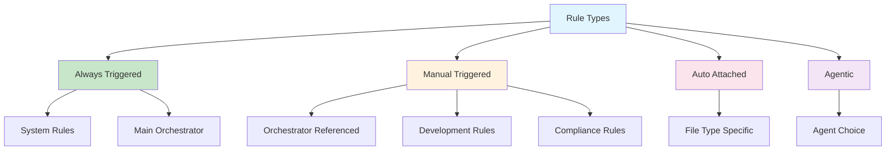
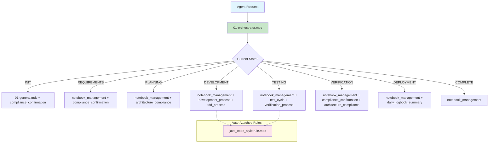

# Common Rules Server Architecture

## Overview
The Common Rules Server is architected for maintainability, extensibility, and compliance. It uses a layered approach, strict boundaries, and proven design patterns to support both human and agentic workflows. The system provides a **general, agnostic framework** for creating rule-based agent instruction sets with proper state machine orchestration.

## Core Architecture Principles

### Rule System Philosophy
**Rules are Agent instructions that tell the Agent where to look and what to check, not implementations.** The system is designed to be:
- **Technology Agnostic**: Rules adapt to any project type by reading from documentation
- **Documentation Driven**: Project-specific behavior based on README.md and ARCHITECTURE.md
- **State Machine Orchestrated**: Clear workflow with forced rule sequences
- **Extensible**: Easy to add new rule types and categories

## Project Structure

```
common-rules-server/
├── ARCHITECTURE.md
├── Dockerfile
├── README.md
├── main.py
├── pyproject.toml
├── src/
│   ├── common_rules_server/
│   │   ├── __init__.py
│   │   ├── __main__.py
│   │   ├── domain/
│   │   │   ├── __init__.py
│   │   │   └── rule.py
│   │   ├── mcp_server.py
│   │   ├── resources/
│   │   │   ├── __init__.py
│   │   │   ├── artifacts/
│   │   │   │   └── code_style/
│   │   │   │       ├── checkstyle.xml
│   │   │   │       └── suppressions.xml
│   │   │   └── rules/
│   │   │       ├── __init__.py
│   │   │       ├── system/
│   │   │       │   ├── 01-general.mdc
│   │   │       │   └── 01-orchestrator.mdc
│   │   │       └── user/
│   │   │           ├── agentic/
│   │   │           │   └── daily_logbook_summary_rule.mdc
│   │   │           ├── auto-attached/
│   │   │           │   └── java_code_style.rule.mdc
│   │   │           ├── compliance/
│   │   │           │   └── project_architecture_compliance.rule.mdc
│   │   │           ├── development/
│   │   │           │   ├── development_process.rule.mdc
│   │   │           │   ├── deviation_process.rule.mdc
│   │   │           │   ├── docs_generation_workflow.rule.mdc
│   │   │           │   ├── documentation_process.rule.mdc
│   │   │           │   ├── tdd_process.rule.mdc
│   │   │           │   ├── test_cycle.rule.mdc
│   │   │           │   └── verification_process.rule.mdc
│   │   │           └── orchestration/
│   │   │               ├── compliance_confirmation.rule.mdc
│   │   │               └── notebook_management.rule.mdc
│   │   ├── service/
│   │   │   ├── __init__.py
│   │   │   └── rule_service.py
│   │   └── util/
│   │       ├── __init__.py
│   │       └── rule_parsing.py
│   └── test/
│       ├── test_integration_mcp_server.py
│       └── test_rule_factory.py
```

### Rule Type Hierarchy


### Current Rule Categories

### 1. Always Triggered Rules (System Rules)
**Purpose**: Core orchestration and system-level rules that run automatically

- **01-general.mdc** (System Rule)
  - **Trigger**: Always executed
  - **Purpose**: System-level operations (cost tracking, git status, build status)
  - **Type**: System-level operations

- **01-orchestrator.mdc** (Main Orchestrator)
  - **Trigger**: Always executed
  - **Purpose**: State machine that forces specific rule sequences and provides clear agent instructions
  - **Type**: State machine orchestration

### 2. Manual Triggered Rules
**Purpose**: Rules triggered by orchestrator references or specific user requests

#### Orchestration Rules
- **compliance_confirmation.rule.mdc** (in orchestration/)
  - **Trigger**: Manual - beginning/end of tasks
  - **Purpose**: Project structure and architecture compliance validation
  - **Type**: Process validation

- **notebook_management.rule.mdc** (in orchestration/)
  - **Trigger**: Manual - every state transition
  - **Purpose**: Notebook creation, updates, and organization
  - **Type**: Documentation management

#### Development Rules (in development/)
- **development_process.rule.mdc**
  - **Trigger**: Manual - development workflow orchestration
  - **Purpose**: Orchestrates development phases (documentation, TDD, verification, deviation)
  - **Type**: Sub-orchestrator

- **tdd_process.rule.mdc**
  - **Trigger**: Manual - TDD implementation
  - **Purpose**: Test-Driven Development cycle (Red-Green-Refactor)
  - **Type**: Development methodology

- **verification_process.rule.mdc**
  - **Trigger**: Manual - verification needed
  - **Purpose**: Build verification, checkstyle, and test execution
  - **Type**: Quality assurance

- **test_cycle.rule.mdc**
  - **Trigger**: Manual - test coverage analysis
  - **Purpose**: Test coverage analysis and missing test implementation
  - **Type**: Testing process

- **documentation_process.rule.mdc**
  - **Trigger**: Manual - documentation review/update
  - **Purpose**: Documentation review and update processes
  - **Type**: Documentation management

- **docs_generation_workflow.rule.mdc**
  - **Trigger**: Manual - documentation needs
  - **Purpose**: Documentation generation with requirements analysis and stakeholder input
  - **Type**: Workflow orchestration

- **deviation_process.rule.mdc**
  - **Trigger**: Manual - when deviations needed
  - **Purpose**: Handling deviations from standard development processes
  - **Type**: Process management

#### Compliance Rules (in compliance/)
- **project_architecture_compliance.rule.mdc**
  - **Trigger**: Manual - architecture review
  - **Purpose**: Comprehensive architecture compliance checking
  - **Type**: Compliance validation

### 3. Auto Attached Rules (in auto-attached/)
**Purpose**: Rules that automatically trigger based on file types or context

- **java_code_style.rule.mdc**
  - **Trigger**: Auto-attached when working with Java files
  - **Purpose**: Java code style validation using checkstyle
  - **Type**: File-type specific validation

### 4. Agentic Rules (in agentic/)
**Purpose**: Rules that the agent chooses when to use

- **daily_logbook_summary_rule.mdc**
  - **Trigger**: Agentic - daily summary needed
  - **Purpose**: Daily summary generation from notebook entries
  - **Type**: Reporting

## State Machine Orchestration

### Current State Machine Implementation
The **01-orchestrator.mdc** implements a proper state machine with:

```
INIT → REQUIREMENTS → PLANNING → DEVELOPMENT → TESTING → VERIFICATION → DEPLOYMENT → COMPLETE
```

### Key Features
1. **Clear Agent Instructions**: Each state provides specific instructions to the agent
2. **Forced Rule Sequences**: The orchestrator forces specific rules to be executed
3. **State Transitions**: Clear criteria for moving between states
4. **Repetitive Subroutines**: Notebook management in every state, compliance checking at beginning/end

### Framework Architecture

#### Orchestration System



#### Rule Header System
The .mdc format handles rule types automatically:
- Rules without specific headers default to "manual" triggered
- System rules (01-*.mdc) are always applied
- Auto-attached rules are triggered by file patterns
- Agentic rules are chosen by the agent

## Design Patterns

### Factory Pattern
- **RuleFactory**: Instantiates the correct rule type based on parsed headers
- **Dynamic Rule Creation**: Supports runtime rule type determination
- **Header Parsing**: Extracts rule metadata for proper categorization

### Service Pattern
- **RuleService**: Encapsulates business logic and rule management
- **Separation of Concerns**: Clear boundaries between data, logic, and interface
- **Testability**: Services can be easily unit tested in isolation

### Layered Architecture
- **Clear Separation**: Interface, service, and domain layers are strictly separated
- **Dependency Direction**: Dependencies flow from interface → service → domain
- **Extensibility**: New features can be added at any layer without affecting others

## SOLID Principles

### Single Responsibility
- Each module/class has a single, well-defined responsibility
- Rule types are clearly separated by trigger mechanism
- Service layer focuses solely on rule management

### Open/Closed
- New rule types or features can be added without modifying existing code
- Rule system is extensible through configuration and new rule files
- Protocol layer can be extended without affecting business logic

### Liskov Substitution
- All rule subclasses can be used wherever a Rule is expected
- Rule interface is consistent across all rule types
- Polymorphic behavior is predictable and reliable

### Interface Segregation
- The interface layer exposes only the necessary MCP tools
- Rule interfaces are specific to their use cases
- No unnecessary dependencies between components

### Dependency Inversion
- High-level modules depend on abstractions, not concrete implementations
- Rule service depends on rule interfaces, not specific implementations
- Easy to mock and test components in isolation

## Extensibility Points

### New Rule Types
- Add new rule classes extending the base `Rule` class
- Update `RuleFactory` to handle new rule types
- Add appropriate trigger mechanisms

### New Tools
- Extend the MCP server with new tool definitions
- Implement tool handlers in the service layer
- Add appropriate validation and error handling

### New Protocols
- Protocol layer is abstracted from business logic
- New protocols can be added without affecting rule system
- Clear separation between protocol and domain concerns

## Technology Stack Integration

### MCP (Model Context Protocol)
- **Official SDK**: Uses the official MCP Python SDK for protocol implementation
- **Tool Exposure**: Exposes rule management tools to AI agents
- **Protocol Compliance**: Full compliance with MCP specification

### Python Ecosystem
- **Pydantic**: Data validation and settings management
- **Typer**: CLI framework for command-line interface
- **uv**: Fast dependency management and virtual environment handling

### Containerization
- **Docker**: Containerized deployment for consistent environments
- **Multi-stage Builds**: Optimized image size and build times
- **Environment Consistency**: Same runtime environment across development and production

## Compliance and Quality Assurance

### Rule Compliance
- **Documentation Status Check**: Rules verify README.md and ARCHITECTURE.md existence
- **Project-Specific Adaptation**: Rules adapt based on documented architecture
- **User Guidance**: Clear instructions for handling missing documentation

### Testing Strategy
- **Unit Testing**: Individual components tested in isolation
- **Integration Testing**: End-to-end rule system testing
- **Protocol Testing**: MCP protocol compliance verification

### Code Quality
- **Type Hints**: Full type annotation for better IDE support
- **Documentation**: Comprehensive docstrings and inline comments
- **Error Handling**: Robust error handling and user feedback

## References

- [README.md](README.md) - Project overview and usage instructions
