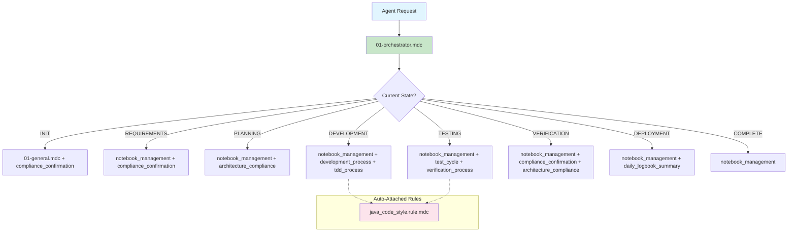

# Common Rules Server

## Overview

This project provides a centralized command-line interface (CLI) that implements the **Model Context Protocol (MCP)** for agentic development. The goal is to manage and provide a common set of rules for AI-assisted IDEs like Cursor, streamlining the process of defining, managing, and applying consistent rule sets across different development environments.

The rules are categorized as:
- **System Rules**: High-priority rules automatically applied in all AI interactions. These are general-purpose rules that apply across all projects.
- **User Rules**: Dynamic, project-specific rules used to refine the generation process, which can be applied manually or automatically.

This tool is designed to work alongside the IDE's native rule system, with a clear precedence order to avoid conflicts.

## Technology Stack

This project uses the following technology stack:

- **Language:** Python 3.11+ (Docker image uses Python 3.12)
- **Core Dependencies:**
  - [typer[all] >= 0.12.3](https://typer.tiangolo.com/) — CLI framework
  - [pydantic >= 2.7.4](https://docs.pydantic.dev/) — Data validation and settings management
  - [mcp >= 1.9.3](https://github.com/modelcontextprotocol/python-sdk) — Model Context Protocol SDK
- **Development Dependencies:**
  - [pytest >= 8.2.2](https://docs.pytest.org/) — Testing framework
  - [pytest-cov >= 5.0.0](https://pytest-cov.readthedocs.io/) — Test coverage reporting
- **Build System:** [Hatchling](https://hatch.pypa.io/) (via `pyproject.toml`)
- **Dependency Management:** [uv](https://github.com/astral-sh/uv) (used in Dockerfile and for local development)
- **Entrypoints & Scripts:**
  - `common-rules` (CLI entrypoint, defined in `pyproject.toml`)
  - `main.py` (manual/local entrypoint)
  - `src/main/python/mcp_server.py` (main MCP server implementation)
- **Packaging:**
  - Source and resources included via Hatch build config
- **Containerization:**
  - Dockerfile provided (uses `python:3.12-slim-bookworm` and `uv` for dependency management)

See `pyproject.toml` and the Dockerfile for full details.

### 7. Triggering MCP Tools from the Terminal

To call tools like `get_user_rules` from the terminal, you must use an MCP-compatible client. The protocol requires a handshake and specific message structure; direct echo/pipe will not work.

## Rule System Architecture

### Rule Types by Trigger Mechanism

The framework supports four types of rules with different trigger mechanisms:

1. **Always Triggered Rules** (System Rules)
   - Core orchestration and system-level rules that run automatically
   - Includes main orchestrator and general system operations

2. **Manual Triggered Rules**
   - Rules triggered by orchestrator references or specific user requests
   - Includes orchestration, development, and compliance rules

3. **Auto Attached Rules**
   - Rules that automatically trigger based on file types or context
   - Independent "lonely wolves" - never mentioned in orchestrator

4. **Agentic Rules**
   - Rules that the agent chooses when to use
   - Independent "lonely wolves" - never mentioned in orchestrator

### Current Rule Categories

### 1. Always Triggered Rules (System Rules)
**Purpose**: Core orchestration and system-level rules that run automatically

- **01-general.mdc** (System Rule)
  - **Trigger**: Always executed
  - **Purpose**: System-level operations (cost tracking, git status, build status)
  - **Type**: System-level operations

- **01-orchestrator.mdc** (Main Orchestrator)
  - **Trigger**: Always executed
  - **Purpose**: State machine that forces specific rule sequences and provides clear agent instructions
  - **Type**: State machine orchestration

### 2. Manual Triggered Rules
**Purpose**: Rules triggered by orchestrator references or specific user requests

#### Orchestration Rules
- **compliance_confirmation.rule.mdc** (in orchestration/)
  - **Trigger**: Manual - beginning/end of tasks
  - **Purpose**: Project structure and architecture compliance validation
  - **Type**: Process validation

- **notebook_management.rule.mdc** (in orchestration/)
  - **Trigger**: Manual - every state transition
  - **Purpose**: Notebook creation, updates, and organization
  - **Type**: Documentation management

#### Development Rules (in development/)
- **development_process.rule.mdc**
  - **Trigger**: Manual - development workflow orchestration
  - **Purpose**: Orchestrates development phases (documentation, TDD, verification, deviation)
  - **Type**: Sub-orchestrator

- **tdd_process.rule.mdc**
  - **Trigger**: Manual - TDD implementation
  - **Purpose**: Test-Driven Development cycle (Red-Green-Refactor)
  - **Type**: Development methodology

- **verification_process.rule.mdc**
  - **Trigger**: Manual - verification needed
  - **Purpose**: Build verification, checkstyle, and test execution
  - **Type**: Quality assurance

- **test_cycle.rule.mdc**
  - **Trigger**: Manual - test coverage analysis
  - **Purpose**: Test coverage analysis and missing test implementation
  - **Type**: Testing process

- **documentation_process.rule.mdc**
  - **Trigger**: Manual - documentation review/update
  - **Purpose**: Documentation review and update processes
  - **Type**: Documentation management

- **docs_generation_workflow.rule.mdc**
  - **Trigger**: Manual - documentation needs
  - **Purpose**: Documentation generation with requirements analysis and stakeholder input
  - **Type**: Workflow orchestration

- **deviation_process.rule.mdc**
  - **Trigger**: Manual - when deviations needed
  - **Purpose**: Handling deviations from standard development processes
  - **Type**: Process management

#### Compliance Rules (in compliance/)
- **project_architecture_compliance.rule.mdc**
  - **Trigger**: Manual - architecture review
  - **Purpose**: Comprehensive architecture compliance checking
  - **Type**: Compliance validation

### 3. Auto Attached Rules (in auto-attached/)
**Purpose**: Rules that automatically trigger based on file types or context

- **java_code_style.rule.mdc**
  - **Trigger**: Auto-attached when working with Java files
  - **Purpose**: Java code style validation using checkstyle
  - **Type**: File-type specific validation

### 4. Agentic Rules (in agentic/)
**Purpose**: Rules that the agent chooses when to use

- **daily_logbook_summary_rule.mdc**
  - **Trigger**: Agentic - daily summary needed
  - **Purpose**: Daily summary generation from notebook entries
  - **Type**: Reporting

### Framework Architecture

#### Orchestration System



#### Rule Header System
The .mdc format handles rule types automatically:
- Rules without specific headers default to "manual" triggered
- System rules (01-*.mdc) are always applied
- Auto-attached rules are triggered by file patterns
- Agentic rules are chosen by the agent

## User Customization Framework

### Creating Custom Rule Sets

Users can create their own rule sets by:

1. **Defining Rule Types**:
   - Always triggered (system/orchestration)
   - Manual triggered (orchestrator referenced)
   - Auto attached (file/context specific)
   - Agentic (agent choice)

2. **Setting Up Orchestration**:
   - Main orchestrator for overall workflow
   - Sub-orchestrators for specific processes
   - Cross-cutting activities for consistency

3. **Organizing by Context**:
   - Use subdirectories for better organization
   - Group related rules together
   - Maintain clear separation of concerns

### Example Custom Rule Set Structure

```
src/main/resources/rules/
├── system/
│   ├── 01-general.mdc          # Always triggered
│   └── 01-orchestrator.mdc     # Main orchestrator
├── user/
│   ├── orchestration/
│   │   ├── compliance_confirmation.rule.mdc
│   │   └── notebook_management.rule.mdc
│   ├── development/
│   │   ├── development_process.rule.mdc
│   │   ├── tdd_process.rule.mdc
│   │   └── verification_process.rule.mdc
│   ├── compliance/
│   │   └── project_architecture_compliance.rule.mdc
│   ├── auto-attached/
│   │   └── java_code_style.rule.mdc
│   └── agentic/
│       └── daily_logbook_summary_rule.mdc
```

## Default Java Rules as Examples

The current Java-specific rules serve as **implementation examples** showing how to:

1. **Create file-type specific rules** (java_code_style.rule.mdc)
2. **Implement development methodologies** (tdd_process.rule.mdc)
3. **Set up verification processes** (verification_process.rule.mdc)
4. **Handle compliance checking** (project_architecture_compliance.rule.mdc)
5. **Orchestrate complex workflows** (development_process.rule.mdc)

## Documentation
- [Architecture](ARCHITECTURE.md) - System architecture and design patterns

## Key Features

- **Technology Agnostic**: Rules adapt to any project type by reading from documentation
- **Documentation Driven**: Project-specific behavior based on README.md and ARCHITECTURE.md
- **State Machine Orchestration**: Clear workflow with forced rule sequences
- **Extensible Rule System**: Support for multiple rule types and trigger mechanisms
- **MCP Integration**: Seamless integration with AI-assisted IDEs
- **Docker Support**: Containerized deployment for consistent environments

## Running Tests

You can install test dependencies and run tests using the tools below. All dependencies are managed in `pyproject.toml` under `[project.optional-dependencies]`.

### 1. Using pip (recommended)
```sh
pip install -e ".[test]"
pytest src/test/ -v
```

### 2. Using uv
```sh
uv pip install -e ".[test]"
pytest src/test/ -v
```

### 3. Using hatch (if you want to use hatch environments)
```sh
hatch env create
hatch run pytest src/test/ -v
```

**Note:**
- If you encounter file lock errors on Windows, ensure no process is using the installed package or its scripts before installing.
- All test dependencies are specified in `pyproject.toml` for reproducibility.